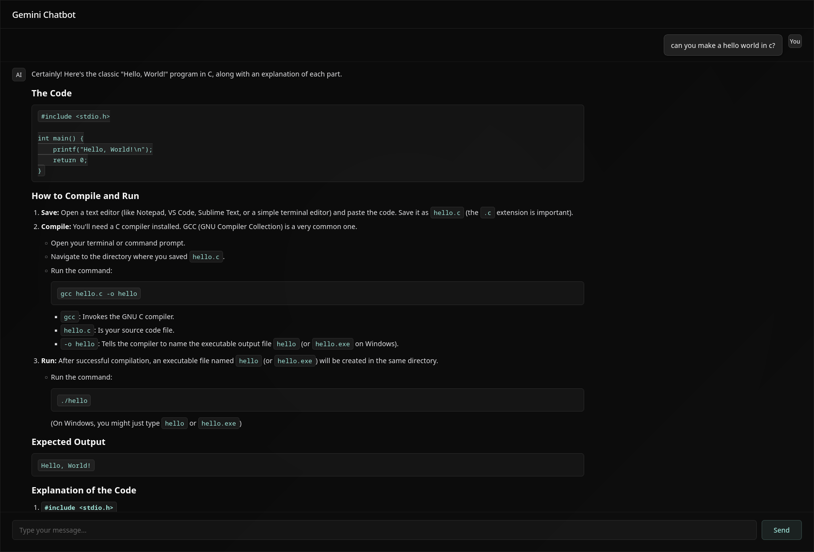

## Prerequisites



Before you begin, ensure you have the following installed on your system:

- Node.js (version 16 or higher)
- npm (Node Package Manager, comes with Node.js)
- Git (for cloning the repository)
- A Google Gemini API key

## Installation

### Step 1: Clone the Repository

Open your terminal and run the following command to clone the project:

```bash
git clone https://github.com/yourusername/gemini-chatbot-api.git
cd gemini-chatbot-api
```

Replace `yourusername` with the actual GitHub username or repository URL.

### Step 2: Install Dependencies

Install all required packages using npm:

```bash
npm install
```

This will install the following dependencies:
- express: Web framework for Node.js
- cors: Enable cross-origin requests
- dotenv: Load environment variables
- @google/genai: Google Gemini AI library

### Step 3: Configure Environment Variables

Create a `.env` file in the root directory of the project:

```bash
touch .env
```

Add your Google Gemini API key to the `.env` file:

```
GEMINI_API_KEY=your_api_key_here
PORT=3000
```

To obtain a Gemini API key:

1. Visit https://aistudio.google.com/app/apikey
2. Click on "Create API Key"
3. Select your project or create a new one
4. Copy the generated API key
5. Paste it into the `.env` file

Important: Never commit the `.env` file to version control. It's already included in `.gitignore`.

### Step 4: Verify Installation

Check that all dependencies are correctly installed by listing them:

```bash
npm list
```

## Running the Application

### Start the Server

Run the following command to start the backend server:

```bash
npm start
```

You should see the following message in your terminal:

```
Server is running on port 3000
```

# Contact
- see my github profile: [fauzymadani](https://github.com/fauzymadani)
- see my blog [here](https://yzuaf.bearblog.dev)
- see my other project [here](https://github.com/fauzymadani?tab=repositories)